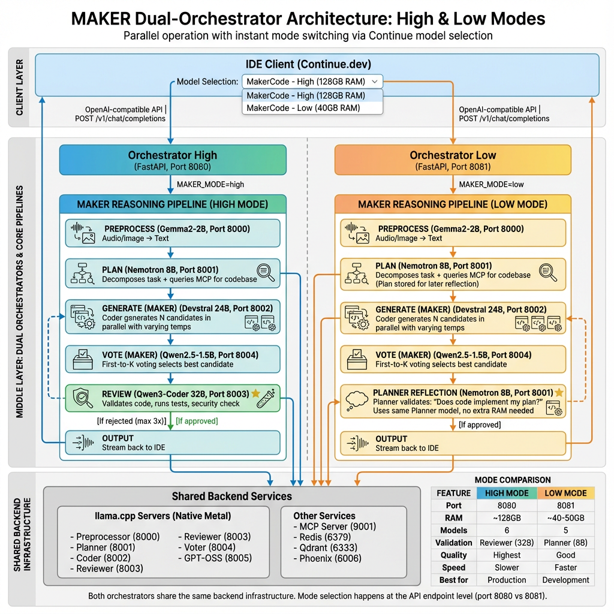

# Localised Code Assistant on Apple Silicon

Applying Cognizant's MAKER paper to build a production-ready local multi-agent coding system optimized for Apple Silicon (M4 Max) with llama.cpp Metal backend.


*Original MAKER pipeline showing the complete 6-stage reasoning process: Preprocess → Plan → Generate (MAKER) → Vote (MAKER) → Review → Output. For the current dual-orchestrator architecture (High & Low modes), see the [Architecture](#architecture) section below.*

## Acknowledgments

This project is built using open-source models and tools. See [CONTRIBUTORS.md](CONTRIBUTORS.md) for a complete list of contributors including Cursor, Gemini, Qwen Coder, and NVIDIA Nemo.

## Features

- **MAKER Architecture**: Multi-Agent Knowledge-Enhanced Reasoning with parallel candidate generation and first-to-K voting
- **5-6 Specialized Agents**: Preprocessor (Gemma2-2B), Planner (Nemotron Nano 8B), Coder (Devstral 24B), Reviewer (Qwen3-Coder 32B, High mode only), Voter (Qwen2.5-1.5B)
- **Dual Orchestrator Architecture**: High mode (port 8080) and Low mode (port 8081) run simultaneously for instant switching
- **llama.cpp Metal Backend**: 2-3x faster than vLLM on Apple Silicon (18-25s end-to-end)
- **Agentic RAG via MCP**: Live codebase queries via REST API (no embeddings, no reindexing)
- **Intelligent Codebase Analysis**: Redis memory + AI-powered README extraction (Gemma2-2B) for smart codebase understanding
- **Agent Self-Awareness**: Agents know their strengths and delegate intelligently
- **Collective Brain**: Multi-agent consensus for complex questions (Planner + Coder + Reviewer)
- **Code Graph**: NetworkX semantic graph with community detection (5-10x faster queries)
- **Melodic Line Memory**: Kùzu graph database for coherent reasoning across agents
- **Parallel Execution**: All agents run simultaneously with Redis state coordination
- **Context Compression**: Hierarchical compression with sliding window (recent messages in full, older messages summarized)
- **OpenAI-Compatible API**: Works with Continue.dev, Open WebUI, or any OpenAI client

## Quick Start

### 1. Download Models

```bash
bash scripts/download-models.sh
```

Downloads all GGUF models (~50GB) to `./models/`

### 2. Start MAKER System

```bash
# Start both High and Low mode orchestrators (recommended)
bash scripts/start-maker.sh all

# OR start only High mode (needs all 6 models including Reviewer)
bash scripts/start-maker.sh high

# OR start only Low mode (5 models, no Reviewer needed)
bash scripts/start-maker.sh low
```

This starts:
- llama.cpp servers (native Metal acceleration)
- Docker services (MCP, Redis, Qdrant, Phoenix)
- Orchestrator(s) on port 8080 (High) and/or 8081 (Low)

### 4. Verify Health

```bash
# Check both orchestrators
curl http://localhost:8080/health  # High mode
curl http://localhost:8081/health  # Low mode

# Check Phoenix observability dashboard
curl http://localhost:6006/health  # Phoenix UI

# Or run full test suite
bash tests/test_workflow.sh
```

### 5. View Observability Dashboard

**Phoenix Observability**: http://localhost:6006

Open this URL in your browser to see:
- All agent interactions and workflow traces
- Performance metrics and timing information
- Success/failure rates
- High vs Low mode comparisons

See [docs/PHOENIX_OBSERVABILITY.md](docs/PHOENIX_OBSERVABILITY.md) for complete guide.

### 3. Connect to IDE

**Option 1: VS Code / Continue.dev (Recommended)**
- Install Continue.dev extension
- Open this project in VSCode - Continue config is auto-detected from `.continuerc.json`
- Usage: Cmd+L → Select model → Chat
- Two models available:
  - **MakerCode - High (128GB RAM)** → Port 8080 (Reviewer validation)
  - **MakerCode - Low (40GB RAM)** → Port 8081 (Planner reflection)
- Switch modes instantly by selecting a different model - no restarts needed!

See [README_CONTINUE.md](README_CONTINUE.md) for complete setup guide.

**Option 2: Open WebUI**
- Access: http://localhost:3000
- Settings → Connections → OpenAI → Base URL: http://localhost:8080 (High) or http://localhost:8081 (Low)

**Option 3: Direct API**
```bash
# High mode (port 8080)
curl -X POST http://localhost:8080/v1/chat/completions \
  -H "Content-Type: application/json" \
  -d '{"model": "multi-agent", "messages": [{"role": "user", "content": "Hello"}]}'

# Low mode (port 8081)
curl -X POST http://localhost:8081/v1/chat/completions \
  -H "Content-Type: application/json" \
  -d '{"model": "multi-agent", "messages": [{"role": "user", "content": "Hello"}]}'
```

## MAKER Implementation

This project implements Cognizant's MAKER (Multi-Agent Knowledge-Enhanced Reasoning) paper:

1. **Parallel Candidate Generation**: Coder agent generates N candidates simultaneously with varying temperatures
2. **First-to-K Voting**: Voter agent evaluates candidates; first to receive K votes wins
3. **Iterative Refinement**: Reviewer validates; failed code loops back to Coder (max 3 iterations)
4. **Escalation**: Persistent failures escalate to Planner for re-decomposition

## Architecture



*The diagram shows the dual-orchestrator architecture with High mode (port 8080, Reviewer validation) and Low mode (port 8081, Planner reflection) running simultaneously. For the original single-orchestrator architecture, see [docs/assets/maker-architecture.png](docs/assets/maker-architecture.png) and [CHANGELOG.md](CHANGELOG.md).*

### Workflow Summary

**High Mode (Port 8080):**
1. **IDE** (Continue.dev/Open WebUI) sends request via OpenAI-compatible API
2. **Preprocessor** converts any audio/image input to text
3. **Planner** queries MCP for codebase context, decomposes task into subtasks
4. **Coder** generates N candidate solutions in parallel (MAKER)
5. **Voter** evaluates candidates using first-to-K voting (MAKER)
6. **Reviewer** validates winning code, runs tests, checks security
7. If rejected, loops back to Coder (max 3 iterations)
8. **Output** streams back to IDE

**Low Mode (Port 8081):**
Same workflow, but step 6 uses **Planner Reflection** instead of Reviewer (validates code against the plan it created, saves ~40GB RAM)

## Performance

| Agent | Model | Speed (Metal) | RAM |
|-------|-------|---------------|-----|
| Preprocessor | Gemma2-2B | 180+ t/s | 1.5GB |
| Planner | Nemotron Nano 8B | 118-135 t/s | 4-5GB |
| Coder | Devstral 24B | 78-92 t/s | 14-16GB |
| Reviewer | Qwen3-Coder 32B | 58-68 t/s | 18-20GB |
| Voter | Qwen2.5-1.5B | 200+ t/s | 1GB |

**End-to-end**: 18-25 seconds for complex refactors  
**Peak RAM**: ~40GB (leaves 88GB headroom on M4 Max 128GB)

## Context Compression

The system implements **hierarchical context compression** (similar to Claude's approach) to efficiently use full context windows:

- **Recent messages** (default: 8000 tokens) - Kept in full for immediate context
- **Older messages** - Automatically summarized by Preprocessor (Gemma2-2B) when context exceeds limits
- **Auto-compression** - Triggers when total context approaches `MAX_CONTEXT_TOKENS` (default: 32000)
- **Per-task history** - Each task maintains its own conversation history and compression state

**Configuration** (via environment variables):
- `MAX_CONTEXT_TOKENS=32000` - Total context budget before compression
- `RECENT_WINDOW_TOKENS=8000` - Recent messages kept in full
- `SUMMARY_CHUNK_SIZE=4000` - Chunk size for summarization

This replaces the previous hard 2000-character truncation, allowing the system to use the full context window (128K for Planner/Coder, 256K for Reviewer) while managing long conversations efficiently.

## Documentation

**Quick Links:**

- **[📚 Complete Documentation Index](docs/README.md)** - All documentation organized by topic
- **[🚀 README_CONTINUE.md](README_CONTINUE.md)** - Continue VSCode extension setup (easiest way to use MAKER)
- **[📖 CLAUDE.md](CLAUDE.md)** - Complete project documentation for Claude Code
- **[🎚️ docs/MAKER_MODES.md](docs/MAKER_MODES.md)** - High vs Low mode comparison
- **[🔍 docs/PHOENIX_OBSERVABILITY.md](docs/PHOENIX_OBSERVABILITY.md)** - Observability and evaluation guide
- **[⚙️ docs/DUAL_ORCHESTRATOR_SETUP.md](docs/DUAL_ORCHESTRATOR_SETUP.md)** - Architecture deep dive
- **[📝 CHANGELOG.md](CHANGELOG.md)** - Project changelog

## Troubleshooting

| Issue | Solution |
|-------|----------|
| Slow speed (<100 t/s) | Verify `--n-gpu-layers 999` in start script |
| OOM on large tasks | Reduce `--ctx-size` or use Q4_K_M quant |
| Service keeps crashing | Check logs: `tail -f logs/llama-*.log` |
| Models not downloading | Verify HF token: `huggingface-cli login` |

## References

- [MAKER Paper](https://arxiv.org/abs/2511.09030) - Solving a Million-Step LLM Task with Zero Errors
- [llama.cpp](https://github.com/ggerganov/llama.cpp) - Inference engine with Metal support

## License

MIT
